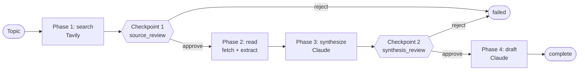
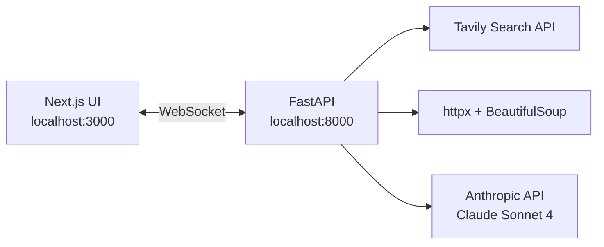

# Agentic Research

A multi-step research agent that searches the web, reads sources, and drafts a cited brief — with human approval at the decision points.


## What it does

- Searches the web with Tavily, then pauses for you to pick which sources are worth reading.
- Fetches and extracts text from the selected URLs.
- Asks Claude to summarize each source, then pauses again so you can review the summaries and steer the draft with free-form feedback.
- Generates a structured research brief with inline citations.
- Streams every step over a WebSocket — phase transitions, tool calls, retries, token usage, and per-step cost.

## Architecture





## Stack

| Layer      | Tech                                                            |
| ---------- | --------------------------------------------------------------- |
| Backend    | Python 3.13, FastAPI, uvicorn, httpx, BeautifulSoup             |
| Frontend   | Next.js 16, React 19, TypeScript, Tailwind CSS 4, react-markdown |
| Transport  | WebSocket (`/ws/research`)                                      |
| Model      | Claude Sonnet 4 (`claude-sonnet-4-20250514`)                    |
| Search     | Tavily                                                          |

## Prerequisites

- Python 3.13+
- Node 20+
- API keys for [Anthropic](https://console.anthropic.com/) and [Tavily](https://tavily.com/)

## Setup

```bash
git clone https://github.com/Akash-Sannidhanam/Agentic-Research.git
cd Agentic-Research

# Backend
python3.13 -m venv .venv
source .venv/bin/activate
pip install -r backend/requirements.txt
cp backend/.env.example backend/.env
# then edit backend/.env and fill in ANTHROPIC_API_KEY and TAVILY_API_KEY

# Frontend
cd frontend
npm install
cd ..
```

## Run

Two terminals:

```bash
# Terminal 1 — backend on http://localhost:8000
source .venv/bin/activate
python -m backend.run
```

```bash
# Terminal 2 — frontend on http://localhost:3000
cd frontend
npm run dev
```

Open http://localhost:3000, enter a topic, and approve the checkpoints as they appear. The backend's CORS origin and the frontend's WebSocket URL are hardcoded to these ports — see [Known limitations](#known-limitations) if you need to change them.

## Agent flow

The agent moves through four phases. Between them are two human-in-the-loop gates, during which the run sits in a `waiting_human` state until you submit a decision.

1. **`search`** — Tavily returns up to 8 results for the topic.
2. **Checkpoint 1 — `source_review`** — you pick which sources to read; rejecting ends the run.
3. **`read`** — each selected URL is fetched with `httpx` and cleaned with BeautifulSoup (scripts, nav, footers stripped; text capped at 8 KB per source). Fetches run **in parallel** via `asyncio.as_completed`, so this phase takes roughly the slowest single fetch instead of the sum.
4. **`synthesize`** — Claude produces a 3-5 bullet summary per source.
5. **Checkpoint 2 — `synthesis_review`** — you can add feedback to steer the draft; rejecting ends the run.
6. **`draft`** — Claude generates a structured brief (executive summary, sections, citations, takeaways).

Transient 5xx errors during `search` and `read` are retried twice with exponential backoff (1s, 2s). 4xx errors are logged and skipped — the run continues with the sources that did load.

The `synthesize` phase uses [prompt caching](https://docs.anthropic.com/en/docs/build-with-claude/prompt-caching) on its system prompt: the first source pays the ~1.25× cache-write premium, subsequent sources hit the cache at ~0.1× input cost. Each trace entry surfaces `cache_creation_tokens` and `cache_read_tokens` so you can see this directly. The `draft` phase runs once per run and is not cached.

The `read` phase fetches all selected URLs concurrently with `asyncio.as_completed`. Wall time drops from `sum(per-url latency)` to roughly `max(per-url latency)` — for the default 5 sources, ~5–10 s sequential becomes ~1–2 s. Trace events stream to the frontend in completion order, so the fastest fetches surface first instead of the user waiting for all reads to flush at once.

## WebSocket API

Useful if you want to drive the backend from something other than the Next.js UI.

**Endpoint:** `ws://localhost:8000/ws/research`

### Client → server

```jsonc
// 1. First message after connect — starts the run
{ "topic": "your research topic" }

// 2. Response to each checkpoint
{
  "decision": "approve",          // or "reject"
  "feedback": "optional string",
  "selected_sources": [0, 2, 3]   // indices, or null to use all
}
```

### Server → client

| Event        | Payload                                                      |
| ------------ | ------------------------------------------------------------ |
| `started`    | `{ run_id }`                                                 |
| `trace`      | `{ entry, state }` — one per agent step                      |
| `checkpoint` | `{ name, data: { message, sources?, summaries? }, state }`   |
| `draft`      | `{ content }` — final markdown brief                         |
| `done`       | `{ state, reason? }`                                         |
| `error`      | `{ error, state }`                                           |

Every event carries the full agent state, so a client can reconnect and re-render without keeping its own copy.

## Project structure

```
backend/
  agent/
    state.py        phases, trace entries, cost tracking
    core.py         agent loop + checkpoint orchestration
  tools/
    search.py       Tavily web search
    reader.py       URL fetcher + HTML-to-text
  api/
    server.py       FastAPI app + WebSocket endpoint
  run.py            uvicorn entry point
frontend/
  app/page.tsx
  components/       TracePanel, CheckpointModal, CostBar
  lib/useResearchAgent.ts   WebSocket hook
tests/
  test_state.py        state machine tests
  test_read_phase.py   parallel read-phase tests
```

## Testing

```bash
python tests/test_state.py
python tests/test_read_phase.py
```

`test_state.py` covers the state machine (phase transitions, trace aggregation, cost math). `test_read_phase.py` exercises the read phase against a stubbed reader to verify parallel fetching and per-source error isolation. The remaining agent loop, tools, and WebSocket protocol are not covered yet.

## Known limitations

- **Localhost-only for now.** Backend CORS is pinned to `http://localhost:3000` and the frontend's WebSocket URL is pinned to `ws://localhost:8000/ws/research`. Both will be parameterized once the project is deployed.
- **Cost math assumes Sonnet pricing.** Rates are hardcoded in `backend/agent/state.py`; swapping models without updating them will produce wrong numbers.
- **No token streaming.** The WebSocket streams _events_ (trace steps, checkpoints, final draft), not tokens. Claude responses arrive whole.
- **4xx fetches degrade silently.** A 404 or 403 on a source is logged as an error trace entry but does not fail the run.
- **No persistence.** Each run is held in memory; closing the tab loses everything.

## Roadmap

- Eval suite with quality metrics across a fixed topic set
- `/history` page showing past runs with cost breakdowns
- Per-phase model routing (Sonnet for summaries, Opus for final draft)
- Structured outputs via tool-use JSON schema for the final brief

## License

[MIT](./LICENSE)
